# Review: Rotten Tomatoes — source data, functional repairs, and seven grading contracts

**Draft status: not ready for maintainer approval.** Runtime code: `6cee8aa1ebba2d520319e4d688ba1cbbfa2282f1`. The full-image attempt failed when the local Docker storage became read-only during COPY after host disk space was exhausted. Recovery and a fresh build are pending; this is not an environment PASS. This review builds on [derenlei's original PR #26](https://github.com/aiming-lab/WebHarbor/pull/26). The original Flask site, account workflows, movie identities, and integration remain the foundation; this is a reviewer continuation of that contribution. The changes below do not constitute a completed end-to-end benchmark evaluation.

## Changes and source coverage

The candidate keeps the original 147 movie IDs and slugs and rebuilds their public facts from the corresponding official Rotten Tomatoes movie and linked cast pages captured on September 7, 2026. The tracked `sites/rotten_tomatoes/data/source_catalog.json` records source URLs, retrieval times, and source hashes. It is a build input; request handlers read SQLite.

The resulting catalog contains 147 movies, 20 genres, 2,236 people, and 2,709 credits across Actor, Director, Producer, and Screenwriter. Source corrections cover release dates, runtimes, genres, credits, scores, and watch availability. Subscription access is distinct from rental or purchase offers. Missing facts remain unknown: 17 audience scores are NULL, and 558 catalog people have no verified photo reference. Unsupported biographies and critic-review text are removed rather than presented as sourced facts. These records document what the captured pages displayed; they are not a guarantee that later upstream pages will retain the same values.

All 147 movies have source-confirmed posters and hero images; 1,678 catalog people reference verified photos. The broader download audit validated 2,380 image outputs, including people outside the final catalog's referenced photo set. Each selected source URL was explicitly present in the captured source, and each output passed MIME checks, image decoding, dimensions, RGB JPEG conversion, and an independent output-hash recheck. Small thumbnail wrappers were not enlarged into desktop posters. Missing identities were not merged by similar names; an explicitly mapped local credit can retain a photo without inventing a Rotten Tomatoes person URL.

The four synthetic benchmark accounts, 16 watchlist entries, and 12 personal ratings remain separate from public movie facts. Synthetic audience reviews were reduced from 28 to 23 by retaining the latest row for each user/movie pair. An explicit unique constraint now enforces that relationship. The offline migration writes a separate output database and preserves its source; startup does not silently migrate populated databases.

Functional repairs include:

- Safe local/same-origin login and watchlist return destinations, while preserving legitimate `next` links.
- Visible validation for bcrypt's 72 UTF-8-byte password limit, invalid ratings and reviews, and account-name boundaries; invalid submissions retain their draft input.
- Atomic SQLite conflict handling for account, watchlist, rating, and review writes. Ratings retain update semantics; duplicate reviews retain the existing review and show an informative message.
- POST logout with CSRF protection, plus regression coverage for existing CSRF and object-ownership checks, invalid IDs, repeated submissions, and rating boundaries.
- Credit-aware, accent-normalized search; role-specific filmography; stable browsing order; NULL-safe scores; and revised listing, detail, person, and account presentation. Visual fidelity still requires the checks listed below.

## Seven retained tasks

The candidate reduces the original 20 tasks to seven. Useful excluded workflows remain functional regression cases. The selection avoids manufacturing extra catalog entries, hiding normal counts, or imposing unrelated navigation to make a task appear harder.

| Task ID suffix | Public task and grading focus |
| --- | --- |
| `0` | Browse Sci-Fi in Streaming at Home; compare streaming-release dates and report every latest-date tie with all screenwriters, as a table or equivalent JSON. Movie year sorting cannot substitute for date comparison. |
| `3` | Search Christopher Nolan; compare Oppenheimer and The Dark Knight for the complete shared-producer intersection and each movie's own streaming date. No third movie is required. |
| `8` | Register the specified new account and confirm its authenticated account page; require the exact new account and no unrelated state changes. |
| `9` | Change Bob's display name and confirm it on the account page; permit only the requested field change. |
| `11` | Remove the specified movie from David's watchlist and report the remaining total; a guessed count without the deletion fails. |
| `14` | Compare Carol's My Ratings and My Watchlist; report the complete rated-minus-watchlisted set with correctly paired personal scores, without changing state. |
| `18` | Find the highest audience score among movies crediting Kevin Feige as Producer; include ties and streaming dates. Accept either eligible-candidate comparison or a valid global descending-score exclusion argument. |

The removed tasks had combinations of thin natural search results, trivial card/count answers, ambiguous or unsupported constraints, or redundant workflows. Search-specific candidate requirements are inapplicable to direct registration/account operations and private-list comparison; that does not exempt those tasks from UI and state evidence. The small private-list task is not claimed to be difficult. The broader date and producer comparisons are plausible challenging tasks, with difficulty still awaiting independent measurement.

Grading contracts reside in `tasks.jsonl` and `verify/`; answer keys are confined to verifiers. They require trusted browser observations and frozen before/after SQLite snapshots. Synchronous DOM evidence, when available, is authoritative; otherwise screenshot claims are checked against their actual trajectory frames through the configured vision judge. Agent thoughts or a correct final answer alone are insufficient. Information tasks require unchanged business state; state tasks require the exact permitted delta. No grader reads a later live database as a substitute for a missing snapshot.

## Visual comparison

The original mirror used a navy header, text/emoji branding, oversized score blocks, and a narrow-screen header that exceeded the viewport. The candidate restores the red header, source logo and fonts, featured-image composition, compact score/synopsis panels, and responsive navigation. The following are unedited, logged-out browser screenshots at equal viewport sizes. Blank image regions in a capture are not by themselves proof of a missing asset. Upstream advertising, trailer playback, TV/editorial sections and the changing current-release catalog are outside this fixed movie benchmark; their absence is a disclosed fidelity limit.

| Page and viewport | Upstream reference | Original PR | Candidate |
| --- | --- | --- | --- |
| Home · 1440 × 1000 | 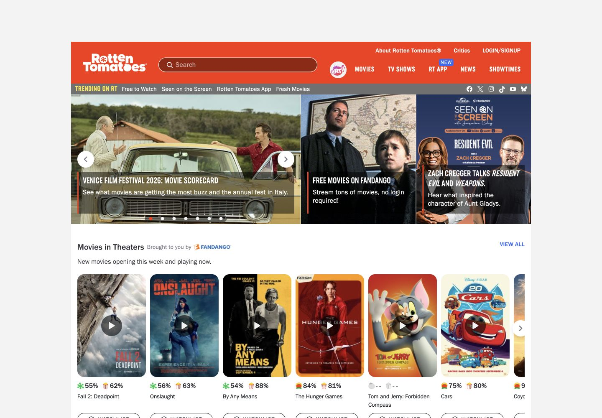 | 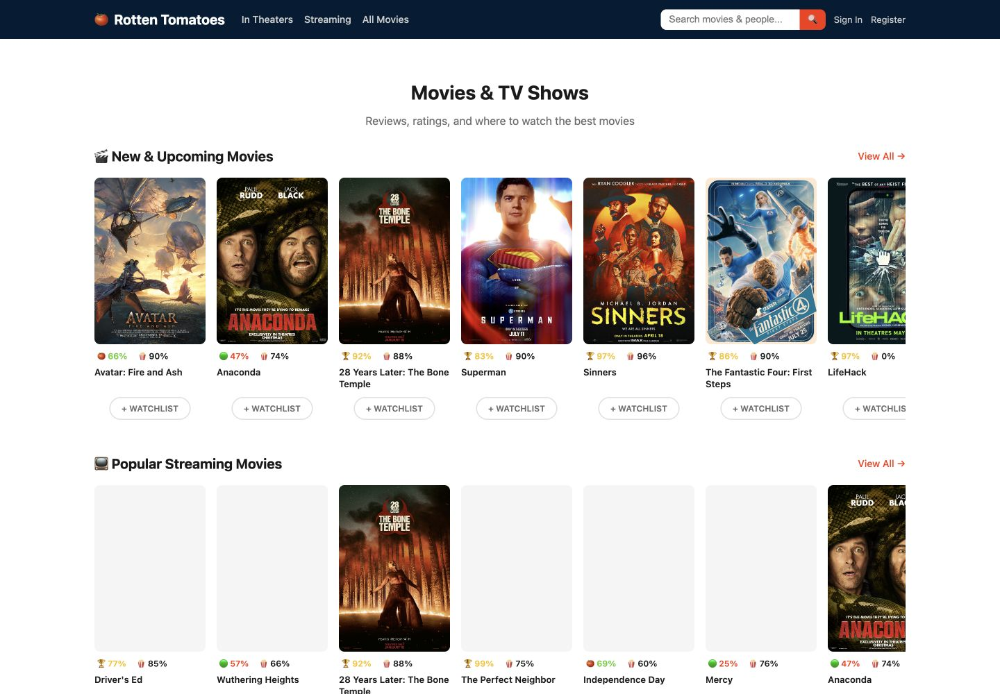 | 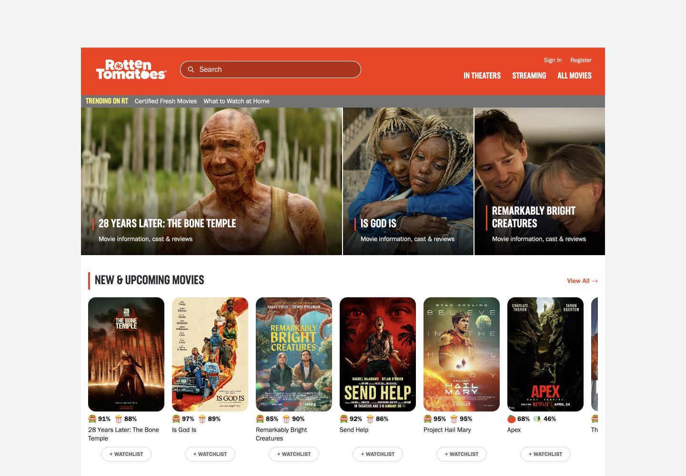 |
| Browse · 1440 × 1000 | 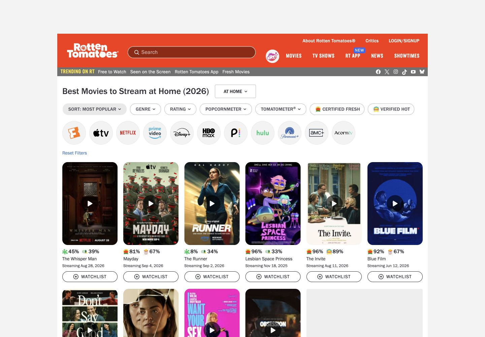 | 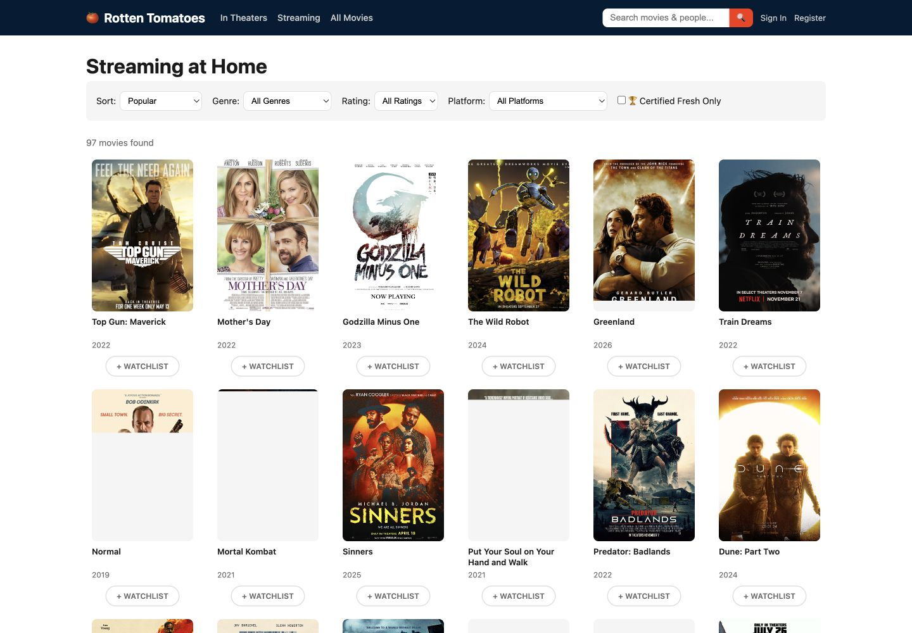 | 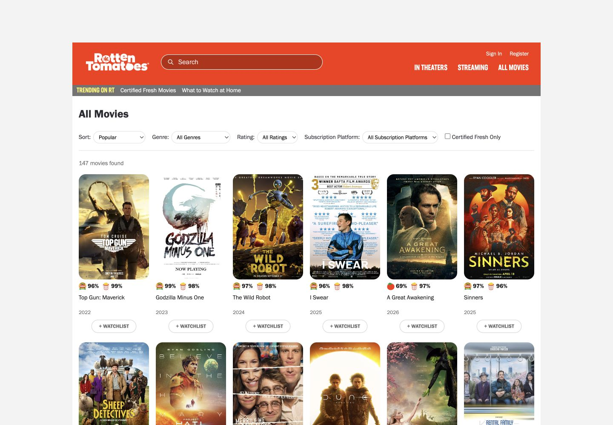 |
| Oppenheimer · 1440 × 1000 | 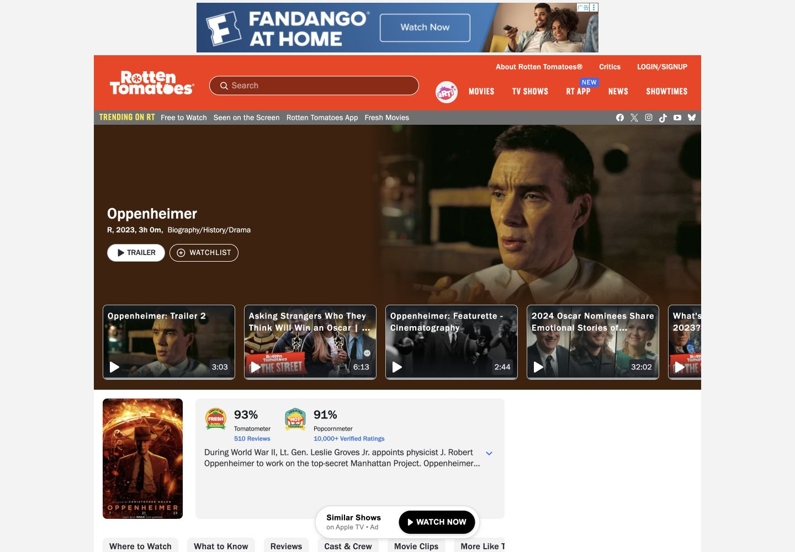 | 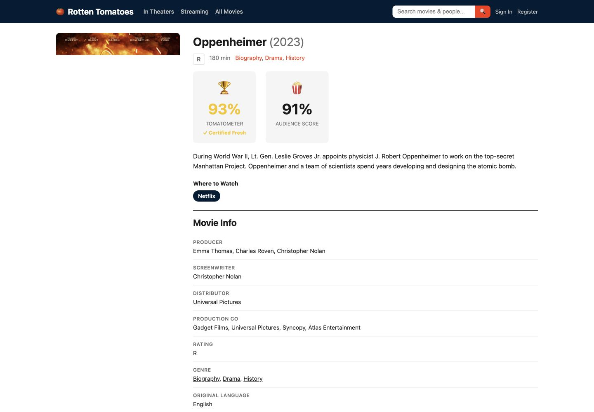 | 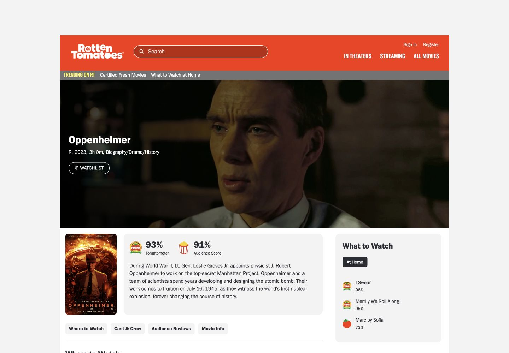 |
| Home · 390 × 844 | 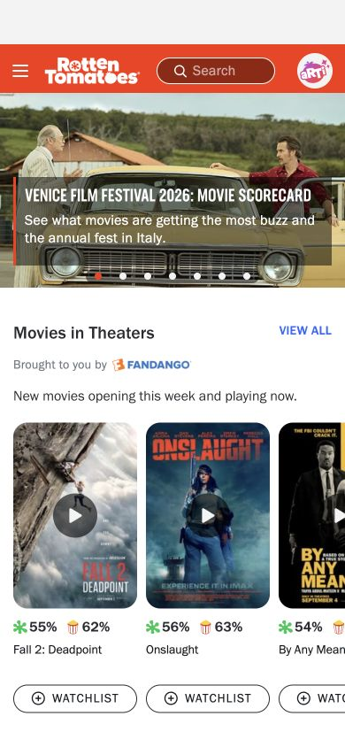 | 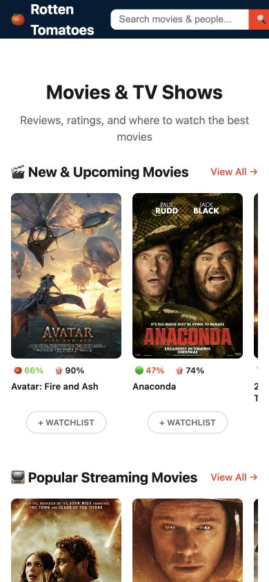 | 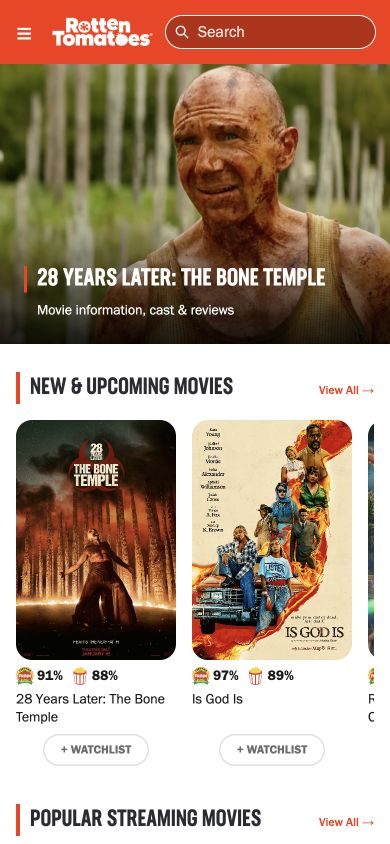 |

The candidate was also inspected at 768 and 320 CSS pixels, including mobile navigation and registration. Document width matched the requested viewport in these checks. Five movie detail templates were inspected: Oppenheimer, Dune: Part Two, Parasite, Superman, and Cold Storage. Offscreen requests were still pending in some captures; these screenshots only establish their visible state. Human comparison and approval of a local regression baseline remain pending. Screenshot identities are recorded in [visual-manifest.json](visual-manifest.json).

## Verification completed and still pending

Completed engineering checks: **35 application tests passed** (27 functional, five source/catalog, three source-download tests). The final portable verifier suite passed **59 unittest methods** (12 date-comparison, 28 producer-comparison, and 19 state/private-list methods), including 73 state/private-list verdict cases. These are constructed fixtures, **not real browser runs**; they establish neither agent success rates nor independent review results. The suite covers no-op and answer-only cases, missing observations, date/name/score pairing, exact database changes, and legitimate alternative routes and response forms. See the [public verifier test log](verifier-tests.txt) and [input/version manifest](verification.json).

The final scoring audit also corrected a hidden route restriction in task 0 and a natural-language false negative in task 3. The task requirements were unchanged by those two fixes; portable regression cases preserve both the legitimate alternatives and invalid shortcuts.

A guided registration pilot completed the account operation but failed verification because a browser observation timeout left a missing intermediate screenshot. The original run is retained as a failure; its evidence is not repaired after the fact. The recording adapter is being corrected before independent runs.

The current asset candidate is [HF PR #55](https://huggingface.co/datasets/ChilleD/WebHarbor/discussions/55), currently **open**, at immutable revision:

```text
68798983027ceaf17df62f6167625baae38a160a
rotten_tomatoes.tar.gz: 777480887 bytes
SHA-256: 67d7206031d284e268d9f5887693ebe8059555a671a604efb22c51a5fae6934d
```

The archive's public LFS identity matches this hash. `.assets-revision` points to this review revision; it is not yet a merged-asset claim. Final acceptance remains **PENDING**:

- A clean full-image build after recovery from the failed local storage attempt, all 20 site health checks, and reset/restart/reset-all checks with seed-byte equality.
- Independent real runs of all seven revised tasks, primary verifier and secondary LLM judgments, and targeted shortcut/no-op/wrong-state/missing-evidence checks.
- Human visual comparison against the attached upstream/candidate screenshots and the running mirror. Automated viewport checks do not substitute for human acceptance.
- Independent Claude Code review, HF merge, and the final code/asset revision pair.

## Reproduction

Run from the review checkout's repository root with Docker, Python 3.12, `uv`, and the `hf` CLI installed. These instructions describe a fresh reproduction after storage recovery. The failed local build did not reach full-image HTTP and reset verification. They follow the repository's [contribution workflow](https://github.com/aiming-lab/WebHarbor/blob/main/CONTRIBUTING.md).

```bash
set -e
ASSETS_REVISION=68798983027ceaf17df62f6167625baae38a160a ./scripts/fetch_assets.sh
python3 - <<'PY'
import hashlib
from pathlib import Path
p = Path('sites/.cache/tarballs/rotten_tomatoes.tar.gz')
with p.open('rb') as f:
    assert hashlib.file_digest(f, 'sha256').hexdigest() == \
        '67d7206031d284e268d9f5887693ebe8059555a671a604efb22c51a5fae6934d'
PY
./scripts/build.sh webharbor:pr26-review
docker run -d --rm --name wh-pr26-review \
  -p 8201:8101 -p 41000-41019:40000-40019 webharbor:pr26-review
curl --fail --silent --show-error --retry 60 --retry-delay 1 \
  --retry-connrefused --retry-max-time 120 http://localhost:8201/health
for port in $(seq 41000 41019); do
  curl --fail --silent --output /dev/null "http://localhost:$port/"
done
curl --fail -X POST http://localhost:8201/reset/rotten_tomatoes
docker exec wh-pr26-review sha256sum \
  /opt/WebSyn/rotten_tomatoes/instance/rotten_tomatoes.db \
  /opt/WebSyn/rotten_tomatoes/instance_seed/rotten_tomatoes.db
docker exec wh-pr26-review python -m unittest discover \
  -s /opt/WebSyn/rotten_tomatoes/tests -v
docker exec wh-pr26-review python -m unittest discover \
  -s /opt/WebSyn/rotten_tomatoes/verify -p 'test_*contracts.py' -v
```

Require readiness and matching database hashes before continuing. Exercise `POST /restart/rotten_tomatoes` and `POST /reset-all` on port 8201 and recheck readiness; repeat the seed comparison after reset. Wait for readiness after boot rather than treating an initial connection failure as a completed test.

To execute one independent example, configure `OPENAI_API_KEY`, `OPENAI_BASE_URL`, and `JUDGE_MODEL` for the supported agent/judge endpoint. Capture consistent snapshots with SQLite's backup API, before the agent starts and after it ends **before any reset**:

```bash
set -e
(cd agent_demo && uv sync && uv run playwright install chromium)
rt_run_dir="$PWD/runs/rotten-tomatoes-3"
test ! -e "$rt_run_dir"
mkdir -p "$rt_run_dir"
snapshot_rt() {
  docker exec wh-pr26-review python -c '
import sqlite3
with sqlite3.connect("file:/opt/WebSyn/rotten_tomatoes/instance/rotten_tomatoes.db?mode=ro", uri=True) as src:
    with sqlite3.connect("/tmp/rt-snapshot.db") as dst:
        src.backup(dst)
'
  docker cp wh-pr26-review:/tmp/rt-snapshot.db "$1"
}
curl --fail -X POST http://localhost:8201/reset/rotten_tomatoes
snapshot_rt "$rt_run_dir/before.db"
uv run --project agent_demo python agent_demo/agent.py \
  --tasks_file sites/rotten_tomatoes/tasks.jsonl \
  --task_id RottenTomatoes--3 --url http://localhost:41019/ \
  --max_steps 40 --out_dir "$rt_run_dir"
snapshot_rt "$rt_run_dir/after.db"
uv run --project agent_demo python agent_demo/eval_judge.py \
  --run_dir "$rt_run_dir" --verifier True --out "$rt_run_dir/verifier.json"
uv run --project agent_demo python agent_demo/eval_judge.py \
  --run_dir "$rt_run_dir" --out "$rt_run_dir/llm-judge.json"
```

Repeat with distinct, fresh output directories and a reset for suffixes `0, 3, 8, 9, 11, 14, 18`; choose and report a sufficient step budget for each task. Preserve the actual trajectory, screenshots, snapshots, model settings, and grader outputs. Do not substitute constructed evidence or edit a trajectory to repair missing observations. Use absolute run-directory paths because the verifier subprocess runs from `agent_demo`.
