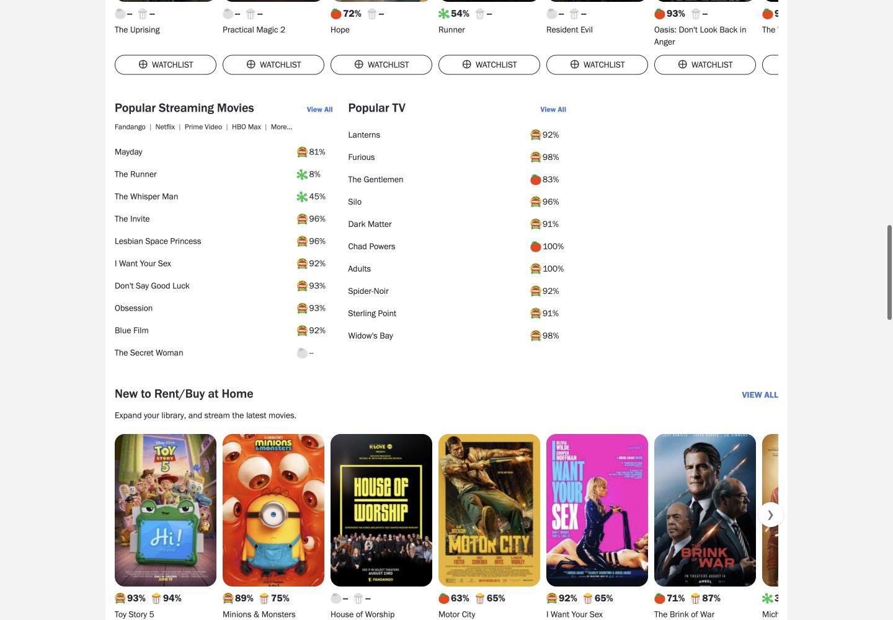
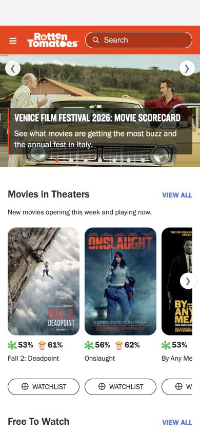

# Review: Rotten Tomatoes — homepage coverage, sourced catalog, and seven grading contracts

**Draft; not ready for maintainer approval. Accepted task runs: 0.** This continues [derenlei's original PR #26](https://github.com/aiming-lab/WebHarbor/pull/26), retaining the original Flask site, account workflows, integration and 147 movie identities. The current integration candidate is `201324a59be7803d916a3570dee2f539d406ff98`, pinned to [HF PR #55](https://huggingface.co/datasets/ChilleD/WebHarbor/discussions/55) at immutable revision `2ec8b226ce8c8cdcdd531812b9738811264eb0ce`. Seven real UI runs now have primary PASS on their separately recorded scorer versions: three assisted read-only runs and four guided account tasks. The T14 original FAIL and corrected reevaluation are preserved, with the final bounded repair at `ca36e5bd87707e16aa6c1a636571b0c4641b8aa2`. The current fixture suite passed 124 methods; unchanged application and seed inputs retain the earlier 44-method and integrated 21-site evidence. Independent Claude judgment returned PASS for all seven designated candidate executions and FAIL for the two retained interrupted attempts. Evidence reconciliation attributes the R0/R18 secondary disagreements to omitted earlier observations; original secondary FAIL outputs are retained. The owner accepted the shown repaired homepage on September 8, 2026. The full current Dockerfile build remains pending; no overall acceptance or blanket visual-fidelity PASS is claimed.

**Current integration:** upstream OSU occupies port 40020; the current candidate has 22 registered sites with Rotten Tomatoes at 40021. Registry/launcher agreement and Python AST checks passed. The incremental image derived from the verified 21-site parent passed four rounds of 22-site health/homepage checks, RT restart/reset preservation, OSU image/reset checks and reset-all. This is bounded derivative-image engineering evidence; a complete current Dockerfile build remains **NOT_VERIFIED** because of available storage. The earlier 21-site checks below retain their historical scope. [Current static and asset binding](integration-22-candidate.json) records the integration separately from all historical task/test versions.

## Homepage and source coverage

An earlier review candidate reduced the homepage to three sections and incorrectly treated TV, editorial content and current-release sections as outside scope without an approved scope change. Inspection confirmed that the reference already had 14 main sections; this was an omission, not a later source-site update. This revision restores those sections in their captured source order, including four compact rankings, seven hero slides, side cards, trending links and complete View All destinations.

The sequence is Movies in Theaters; Free To Watch; Limited Releases Now Playing; Coming Soon To Theaters; Popular Streaming Movies; Popular TV; New to Rent/Buy at Home; Best New Animated Movies; New TV This Week; Top 10 Box Office; Latest Certified Fresh Movies & TV; RT Recommends: Weekly Staff Picks; Trailers & Videos; Discover More. Popularity and box-office ordering come from the captured homepage; audience-score sorting is not substituted for them.

The September 7, 2026 source snapshot adds 123 movies while preserving the previous 147 rows and all 2,236 existing person identities. The catalog now contains **270 movies and 3,852 people**; new credits reuse 248 existing person IDs. The increment includes **1,371 decoded and hash-checked assets**: 123 posters, 120 hero images and 1,128 person photos. No preexisting image was overwritten. The candidate archive also preserves all 1,986 previous static files.

There are **23 TV detail records and 19 feature records** (14 official editorial pages plus five homepage video/promotion cards). TV fields retain their own season, score and viewing-information semantics. Features offer short source summaries and original-source links. Full articles, remote video playback, advertising and commercial services are not reproduced or claimed to work offline.

The tracked [movie/person catalog](../../../sites/rotten_tomatoes/data/source_catalog.json), [homepage snapshot](../../../sites/rotten_tomatoes/data/homepage.json), [TV catalog](../../../sites/rotten_tomatoes/data/tv_catalog.json) and [feature catalog](../../../sites/rotten_tomatoes/data/feature_catalog.json) retain source URLs, capture times and hashes. Explicit offline seed construction imports movie/person rows and three SQLAlchemy `ContentSnapshot` documents into SQLite. HTTP requests read SQL and use local image files; they do not depend on runtime JSON reads, remote JavaScript or image hotlinks. Existing populated databases are not silently migrated. The explicit migration requires authorization for additions and binds its receipt to the input hashes.

Unknown facts stay unknown. Three new movies have no verified hero image; 1,046 people in the merged catalog have no verified photo. Missing scores, dates, roles or TV viewing information are not invented. Movie Info fields and full linked cast pages take precedence over incomplete or conflicting JSON-LD. Homepage and detail snapshots retain their separate source context when they differ.

The four synthetic benchmark accounts, 16 watchlist entries and 12 personal ratings remain intact. Earlier repairs retain safe return destinations, CSRF-protected POST logout, ownership checks, input validation, atomic conflict handling and the unique user/movie review relationship. Public facts and synthetic account state remain separate.

## Task and verifier impact

Seven candidate tasks remain; this revision does not add tasks to meet a quota or relax scoring to match execution results.

| Suffix | Contract and effect of the expanded catalog |
| --- | --- |
| `0` | The unrestricted 41-title task imposed excessive repetitive detail-page work. Its public prompt and rubric now select Subscription Platform = Netflix: 8 Sci-Fi/at-home candidates, all with listed dates. The latest is War Machine, March 6, 2026, with Patrick Hughes and James Beaufort. All 8 still require comparison; the generic missing-date and tied-result rules remain, and legitimate same-origin navigation is valid. |
| `3` | Search Christopher Nolan; report the complete shared producers of Oppenheimer and The Dark Knight and their own streaming dates. Required facts remain unchanged. A bounded parser repair accepts valid Chinese prose and separates producer names from the following streaming-date field. |
| `8`, `9`, `11`, `14` | Registration, display-name update, watchlist deletion and rated-minus-watchlisted comparison retain their exact state contracts. Fresh guided UI runs now cover all four tasks; T14 additionally required the bounded personal-rating prose repair described below. |
| `18` | Four Kevin Feige Producer candidates now include Spider-Man: Brand New Day, the 97% maximum with no listed streaming date. Prompt and rubric explicitly require reporting that absence; the winner cannot be excluded or assigned a guessed date. Complete eligible comparison may use each candidate's Movie Info or the complete Kevin Feige Producer Filmography plus winner Movie Info. The valid global descending-score exclusion route also remains accepted. Valid explanatory comparisons do not add movies to the selected result set. |

Verifiers require native browser observations, screenshots and frozen before/after SQLite snapshots. Information tasks require unchanged business state, including the new content table; state tasks permit only the requested delta. A correct answer without observed UI evidence is insufficient.

The earlier **77-method fixture suite passed** and remains historical evidence for the unrestricted R0 version. An independent informed review found two missing-date parser defects: rejection of clear prose/Markdown and acceptance of partial streaming-date guesses or conflicting JSON aliases. Both were reproduced, fixed and retested against the same closed matrix. All seven original samples now receive their expected verdicts, and the independent rerun passed all 77 methods. The parser remains bounded; this is not a claim of arbitrary natural-language understanding. After the explicit Netflix scope revision, **88 fixture methods passed** (43.133 seconds): the applicable earlier regressions plus 11 new scope checks. They cover omitted/wrong/conflicting platform restrictions, outside-scope winners, incomplete candidates or writers, immutable unrelated state, legitimate direct/keyboard routes and the unchanged missing-date rule. All 8 source records were checked against saved official metadata and the static seed. The separate informed R0 scope recheck returned **GO**: 27 relevant methods passed (1.112 seconds), and 24 independent samples (6 expected PASS, 18 expected FAIL) had no unexpected verdicts. Four public-CLI checks also returned the expected exit codes. This is not an independent rerun of all 88 methods. See the [compact R0 recheck](r0-independent-review.json) and [historical 88-method output](r0-netflix-fixture-tests.txt).

The closed R18 repair then passed [100 methods](r18-repair-100-tests.txt) (16.909 seconds). Its screenshot-only compatibility follow-up passed [106 methods](r18-screenshot-106-tests.txt) (16.796 seconds), retaining the earlier methods and adding six mocked dispatch/refusal checks. After ten R3 Chinese-prose regression methods, the combined suite at that stage passed **[116 methods](combined-verifier-116-tests.txt)** (15.265 seconds). All 17 tested source/test files matched the checkout byte for byte, the seed was unchanged, and no external LLM was called. Original R18 missing-date and R3 English paraphrase samples kept their expected verdicts. Screenshot mocks verify routing and evidence refusal; actual vision accuracy has not been evaluated. See the [source hashes and reproducible command](verifier-regression-summary.json). All these suites are constructed tests, not agent executions, accepted runs or Claude blind-review results.

## Assisted read-only task executions

All three runs used an **independent decision agent + informed controller**: the decision agent received the task and browser observations; the controller already knew the implementation and mechanically executed the chosen actions. The model disclosure is GPT-6 for both roles; exact deployment aliases are unavailable. This is not a fully blind control chain. The original observations, answers and frozen state were preserved, and scoring outputs were saved separately.

| Task | Recorded actions / PNGs | Original primary | Final primary at `80b9c1c` | Interpretation |
| --- | --- | --- | --- | --- |
| R0 | 20 / 41 | PASS | PASS | Compared all eight Netflix candidates, then reported the latest date and complete screenwriter set. |
| R3 | 6 / 13 | FAIL | PASS | The correct Chinese answer was rejected by producer-field parsing. The bounded repair fixes Chinese boundaries and the next date heading without changing the task or original run. |
| R18 | 6 / 13 | FAIL | PASS | The original scorer treated lower-score explanation as extra selected results and omitted the complete Producer Filmography route. The repair accepts that evidenced route and validated comparison prose. |

The recorded official primary reevaluation used the same three frozen originals and separately bound the then-current grader/helper hashes. All three returned exit 0, with unchanged business state. Primary PASS does not complete acceptance: **accepted runs remain 0**. The subsequent four account runs and auxiliary judgments are recorded below; the owner has accepted the shown repaired homepage, while the complete current Dockerfile build remains pending. The subsequent independent execution judgment is recorded below. The R3/R18 repairs were informed code diagnosis, not blind evaluation.

The earlier [read-only execution and scoring snapshot](assisted-task-executions.json) records each full run hash, input/trajectory identity, original failure and latest result. Five byte-identical screenshots illustrate [R0 Netflix scope](images/task-r0-netflix-scope.png), [R0 selected Movie Info](images/task-r0-winner-info.png), [R3 search](images/task-r3-search.png), [R18 complete Filmography](images/task-r18-filmography.png) and [R18 selected Movie Info](images/task-r18-winner-info.png). Each is decoded as PNG and visually checked for credentials; [dimensions and hashes](assisted-task-screenshots.json) bind them to the originals. These few images cannot substitute for complete trajectory/state evidence. Raw trajectories, databases, DOM dumps, internal skills and review case materials are excluded from this public package.

## Guided account tasks and the T14 scoring repair

The four new account-task runs used an **informed GPT-6 controller**, which already knew the task and implementation. They are guided real UI executions, not independent blind exploration. Each run starts from a reset synthetic seed and retains synchronous observations, its original final answer, and before/after snapshots. All 600 original files across these four runs were rehashed after scoring and remained unchanged. All task screenshots are 1280×720; this does not establish complete-task coverage at other viewports.

| Task | Recorded actions / PNGs | Original primary | Latest primary | Frozen state result |
| --- | --- | --- | --- | --- |
| T8 | 8 / 17 | PASS | PASS at `b5e8a55` | Only the requested new synthetic account was added; the existing four users and ten other tables were unchanged. |
| T9 | 10 / 21 | PASS | PASS at `b5e8a55` | Only the requested display name changed; saving and a real reload were observed. |
| T11 | 8 / 17 | PASS | PASS at `b5e8a55` | Only the requested watchlist row was removed; the user's list changed from four to three and a real reload confirmed it. |
| T14 | 8 / 17 | FAIL | PASS at `ca36e5b` | All eleven tables and schema were unchanged; the original answer and both personal collections were retained. |

T14's original Chinese answer placed the complete movie title before a comma and its personal score in the next clause. The previous parser rejected the valid title reference. The scoped repair changes only `verify_14.py` and adds `test_r14_prose_contracts.py`; the task, rubric, original answer, UI run, application and seed are unchanged. The initial six positive/negative methods cover equivalent personal-rating clauses, existing inline references, incorrect/contradictory/wrong-scale scores, unrelated metrics, extra results and partial title names. The original frozen run was reevaluated through the official primary entry point and returned PASS; its original FAIL remains historical evidence. The intermediate fixture suite passed **[122 methods](combined-verifier-122-tests.txt)** in **29.494 seconds** at `3a4cefb`, with all 18 tested source/test files bound to that intermediate repair commit and an unchanged seed. This is constructed regression evidence, not 122 agent runs. The earlier 44 application-method result is reused on unchanged application inputs rather than claimed as a new run. See [the retained 122-method receipt](verifier-regression-122-summary.json).

An independent closed check then found **five false acceptances** in two boundaries: negative score signs and explicit contradictory personal-score attribution. The final `ca36e5b` repair preserves signed values before range validation and rejects clauses that assign the score to another person/metric or deny the account gave that rating. The unchanged 22-sample matrix now receives **22/22 expected verdicts**, including rejection of all five former false acceptances; the independent relevant suite passed **10 methods in 3.620 seconds**. Its [closed review](r14-independent-closed-review.json) and [original test log](r14-independent-closed-tests.txt) are separate from real execution evidence. The original legitimate T14 answer was not edited and its official primary reevaluation again returned PASS. The final full fixture suite passed **[124 methods](combined-verifier-124-tests.txt)** in **31.187 seconds**; [its receipt](verifier-regression-124-summary.json) binds all 18 source/test files and the unchanged seed. The 122-method result above remains an intermediate historical receipt, not the final parser verdict.

The [account execution summary](account-task-executions.json) records full run and trajectory hashes, separate original/latest scores, precise runtime/scorer versions and all-table change counts. T8/T9/T11 retain their original successful scorer receipts; their used scorer files are byte-identical at the current repair commit, so no extra reevaluation is claimed. The earlier interrupted T8 attempt remains an open three-action run with no final answer: primary FAIL, secondary NOT_VERIFIED because the unchanged preparer refuses open executions. Its delayed after capture is explicitly limited.

Five original, unedited images show [T8 identity](images/task-t8-account.png), [T9 after reload](images/task-t9-account-refreshed.png), [T11 after removal/reload](images/task-t11-watchlist-refreshed.png), and T14's [personal Ratings](images/task-t14-ratings.png) and [Watchlist](images/task-t14-watchlist.png). They contain only synthetic benchmark identities and movie content, with no visible password/token; [the screenshot manifest](account-task-screenshots.json) records dimensions and hashes. Selected images do not replace full trajectory/state evidence or owner visual acceptance.

## Secondary judgments and their evidence limits

The separate [secondary-judgment summary](secondary-judgment-summary.json) records fresh Codex CLI 0.147.0 calls. New R3 and T8/T9/T11/T14 received secondary PASS; the earlier interrupted R3 received FAIL. R0 and R18 received **secondary FAIL** because the supplied last four screenshots and upstream `trajectory_text` did not show their complete earlier candidate comparison. Reconciliation with the full frozen observations establishes complete candidate comparisons for both executions. The auxiliary inputs omitted those earlier observations, so their original FAIL results are retained as input-coverage false rejections of the complete runs. The primary results and the independent full-input judgments remain separately recorded. Neither original runs nor rubrics were changed to make the auxiliary result pass.

Each model call received the exact upstream grading text, untruncated action text and only the last four PNGs, without databases, separate DOM/observation files, verifier code/results or prior judgments. All eight calls completed with exit 0, valid JSON responses and no model tool calls. The CLI supplies its usual instruction context, and the exact default model/deployment alias was not exposed; this is a disclosed transport adaptation, not the official API path or independent Claude review. Auxiliary UI PASS does not establish the absence of unrelated database changes: the separate primary and all-table snapshot checks provide that evidence. Claude subsequently adjudicated the complete frozen evidence as recorded below; accepted runs remain **0** pending environment acceptance.

## Independent execution judgment and reconciliation

The [independent summary comment](https://github.com/aiming-lab/WebHarbor/pull/87#issuecomment-5578519612) was published on September 8, 2026. Claude reported `claude-fable-5-1` in a fresh Claude Code session; the exact deployment alias is not independently verifiable. The first verdict file was frozen before comparison with prior graders. Both the return hash and the input manifest binding were verified, and all 664 input files were rehashed successfully. The [public execution-review receipt](independent-execution-review.json) records versions, attempt-level results, limits and the reconciliation; raw independent outputs and handoff materials remain private.

All seven designated candidate attempts (`--0`, `--3`, `--8`, `--9`, `--11`, `--14`, `--18`) received PASS. The earlier two-step `--3` attempt and three-step `--8` attempt separately received FAIL for incomplete execution; neither was completed or combined with later evidence. This judged frozen executions only: it did not run the site or inspect source fidelity, application code or verifier implementation.

R0's synchronized observations include the filtered eight-movie set and all eight streaming dates. R18's earlier Filmography observation shows all four Producer candidates and scores; the winner's complete Movie Info establishes the absent streaming date. Those observations resolve the comparison questions that the auxiliary last-four-image inputs could not answer. No grader, rubric, truncation policy, task or original execution was changed during reconciliation. The auxiliary FAIL outputs remain useful calibration samples; no rerun or overall judge-accuracy improvement is claimed.

An informed spot-check of the shared PASS results for `--3`, `--9` and `--14` confirmed the requested producer/date relation, the sole allowed display-name state change, and the rated-minus-watchlisted personal-score relation. It found one non-blocking factual aside in Claude's `--3` rationale: the recorded mirror lists **Jonathan Nolan** as The Dark Knight's Screenwriter; Christopher Nolan appears as Director. The requested Producer intersection and streaming dates were correct, so the task verdict remains PASS. The frozen judgment is preserved with this separate correction.

Eight recorded primary results were reused after matching their actual grader entry point, verifier, helper and contract hashes to the current checkout. The remaining historical interrupted `--3` negative sample was reevaluated once through the current official primary entry point and still returned FAIL because it has no final `done`; all 58 original frozen files remained unchanged. The existing 124-method suite and the closed T14 22-sample matrix are retained on unchanged inputs, with no claimed new suite run. These bounded checks support closing the scoring disagreements; a complete current Dockerfile build still prevents Ready. The owner subsequently accepted the shown repaired homepage.

## Evidence and remaining acceptance

[Compact verification](homepage-verification.json), [test output](homepage-verification.txt) and [screenshot identities](homepage-visual-manifest.json) separate the evidence purposes:

- **Engineering:** isolated Flask checks produced the expected statuses for 298 GET requests; 1,715 unique rendered image references resolved locally. All 14 source/migration tests passed. Requests still worked with the three content JSON files removed from the isolated fixture; foreign-key checks were clean and the canonical seed stayed byte-identical. These checks establish route/data integrity, not visual fidelity.
- **Earlier 20-site full-image engineering:** the rebuilt image `sha256:4f7a2006c5daa2339073be9a348f8da30016134204fd97109e429ef8e4a654c6` matched all 50 checked source/seed/UI/task/verifier files at that check, including the latest R18 fix. Those task inputs predate the Netflix scope change and the registry predates the TED integration; this image does not establish current 21-site acceptance. At boot, after RT reset and after reset-all, all 20 sites were alive and all 20 homepages returned HTTP 200. Controlled HTTP registration changed users from 4 to 5; official reset removed that fixture user and restored the seed bytes. Reset-all also restored the seed, and a subsequent official RT restart reported ready with all 20 sites alive and unchanged RT bytes. All **44 application tests** passed (27 functional, 14 source/migration, 3 download; 20.934 seconds) in an isolated code/DB fixture; the live service retained seed-byte equality. See [full-environment.json](full-environment.json) and [unmodified application test output](full-app-tests.txt). The verifier suite was not rerun as part of this check.
- **21-site integrated engineering:** image `sha256:b614f764ecb968f820bcde355fdc3e88f77d3f38d382ccbc475ca9888b7f1528` at code `abb70237e66dde47daf822e6bed5505162298e6a` matched 102 frozen files. Three rounds each passed all 21 health/homepage checks. Controlled HTTP registration changed RT users 4→5; restart preserved dirty bytes, reset restored seed bytes, and reset-all recovered all 21 sites. The prior 44 application-test inputs match exactly, so their result is reused without a claimed rerun. This image predates the Netflix R0 revision; later verifier fixture results are separate, and revised task/verifier inputs are explicitly bound to the current external runner. The build used locally verified assets. The later HF upload has independently verified remote identities; a clean remote-only download/rebuild has not been performed. See [versioned full-environment evidence](full-environment.json).
- **22-site derivative engineering:** image `sha256:4ed3d718f69eab3c5fa48bc35591a5cbbfba4cbe2477ef0999bb19468ee4a8ea` binds code `201324a` and HF `2ec8b226`. All 105 copied files match; 27,635 parent files remain unchanged, with 11 expected changes, 90 additions and no unexpected differences. Dependencies match the parent. Four rounds returned 22/22 alive sites and HTTP 200. Controlled HTTP registration followed by restart retained RT state; RT/OSU reset and reset-all restored exact seeds. All 19 OSU images matched their source bytes in three HTTP rounds. The [runtime receipt](integration-22-runtime.json) records results and the 32 exact inputs used to reuse the prior 44 application methods. The [executed derivative Dockerfile](integration-22.Dockerfile) uses the recorded local parent tag; its small context contains `sites/osu/`, `sites/rotten_tomatoes/README.md`, `sites/rotten_tomatoes/tasks.jsonl`, `sites/rotten_tomatoes/verify/`, `websyn_start.sh` and `control_server.py`. It does not fetch/reproduce that parent or replace the current official Dockerfile build.
- **Actual informed browser checks:** 1440, 768, 390 and 320 CSS-pixel widths, hero arrows/dots/End-key control, poster-rail navigation and disabled end control, TV and feature entry points, mobile navigation, login, watchlist addition/removal and logout were exercised. Recorded page widths matched the viewports. SQL evidence recorded one added watchlist row, its removal restored the original rows, and the official reset restored the seed hash. These operations are UI smoke checks, not independent benchmark runs.
- **Owner visual feedback:** on September 8, 2026, the owner accepted the shown repaired homepage after inspecting it. This records the human review of the presented homepage; it does not claim that the owner tested every viewport, detail page or task, or approved a merge. The existing browser/source coverage above remains separately scoped.
- **Pending:** a complete current Dockerfile build after adequate storage is available. Independent execution judgment and the evidence-based scoring reconciliation are complete for this fixed point. All seven current UI runs have version-bound primary PASS, but accepted runs remain 0; environment/task acceptance is still pending. The independent handoff status must be reported separately from these engineering and grading results. The earlier storage-exhaustion build remains failed historical evidence; a superseded image with old R18 code was not accepted. The recorded engineering PASS applies only to the tested image and frozen inputs identified above. The earlier registration pilot with a missing screenshot remains failed evidence.

| Current candidate | Capture |
| --- | --- |
| Desktop homepage |  |
| Streaming and TV rankings |  |
| Mobile homepage |  |

Additional unchanged screenshots cover [768 pixels](images/home-repair-tablet.jpg), [320 pixels](images/home-repair-narrow.jpg), [box office](images/home-repair-box-office.jpg), [TV](images/home-repair-tv.jpg) [feature summaries](images/home-repair-feature.jpg), and the [settled rail end](images/home-repair-rail-end.jpg). These remain the recorded browser observations; the owner accepted the presented repaired homepage on September 8, 2026, without a claim of manually rechecking every listed capture. Earlier upstream, original-PR and pre-expansion candidate images remain identified by [visual-manifest.json](visual-manifest.json); the previous [verification manifest](verification.json) and [59-method log](verifier-tests.txt) remain historical evidence and do not establish acceptance of this expanded version.

## Reproduction status

The earlier [HF asset verification](hf-asset-verification.json) confirms RT archive SHA256 `38f4532aac6307ea6ce7b97f77b4659fd58d10d6bb7f631ae082935fb46f6fe1`, the downloaded manifest hash, and TED identity; all 20 other baseline site archives are unchanged. Tar identities were checked through official LFS/HEAD metadata, without full archive redownload/extraction. The current repository pins `.assets-revision` to `2ec8b226ce8c8cdcdd531812b9738811264eb0ce`. The [OSU asset extension](integration-22-candidate.json) adds only the existing 1,358,551-byte OSU LFS object; every previous dataset object, including Rotten Tomatoes and TED, is unchanged. Historical runs retain their original asset revisions. The tested local archive matches the remote LFS SHA256, so the same application/assets evidence is reused; a full remote-only redownload/rebuild was not performed. Follow the repository [build and contribution workflow](https://github.com/aiming-lab/WebHarbor/blob/main/CONTRIBUTING.md), wait for bounded HTTP readiness, and run:

```bash
python -m unittest discover -s sites/rotten_tomatoes/tests -v
python -m unittest discover -s sites/rotten_tomatoes/verify -p 'test_*contracts.py' -v
```

Run the tests in the site's configured Python environment; the historical 116/122-method and current 124-method receipts used Python 3.12.3 and an isolated byte-identical copy of the verifier directory. Its machine-specific interpreter path is omitted from the public receipt. For actual tasks, capture SQLite backups before execution and immediately after it, before any reset. With an authorized absolute run directory and a separate absolute output path, the official primary invocation is:

```bash
python agent_demo/eval_judge.py --run_dir "$TASK_RUN_DIR" --verifier True --out "$TASK_SCORE_OUTPUT"
```

The recorded primary reevaluations used the existing offline environment and no external LLM; auxiliary judgments are separately recorded in [their own summary](secondary-judgment-summary.json), including the two preserved limited-input FAIL results explained by the subsequent full-evidence reconciliation. Raw run directories are not part of this public package, so the command documents how to score a supplied run rather than claiming that the summary alone reproduces a run. Preserve trajectories and failed observations without editing them. Maintainers retain final approval and merge authority.
