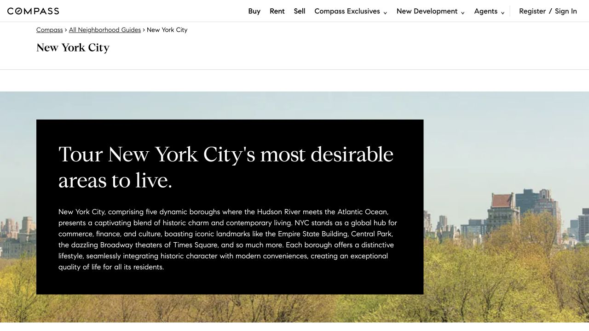
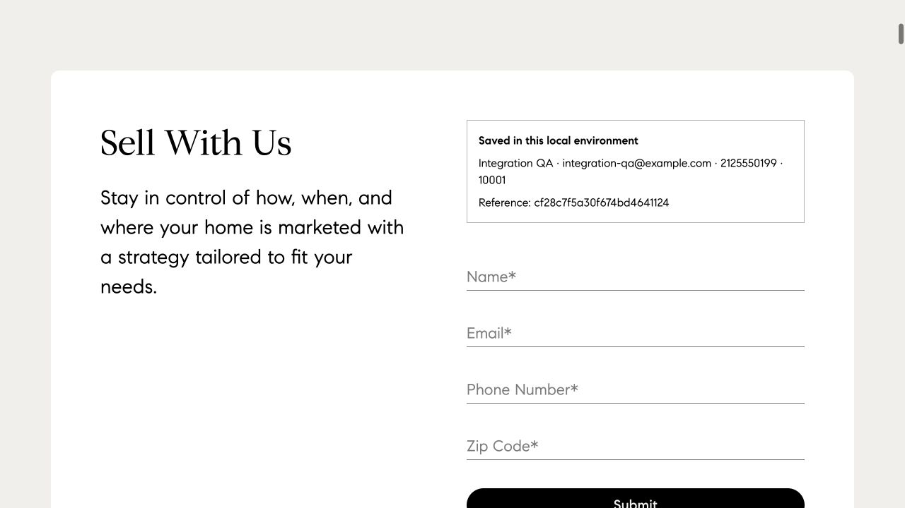

# Compass integration with current main

The previous Ready candidate conflicted with main after TED and Ohio State University merged. This update integrates main `7269134e9db9d10b1a6ac321797be51c72bb1a36` while preserving the original Compass contribution history. The registry now has **22 sites**: TED40019, OSU40020, Compass40021; control8101. The16 Compass task files change only their `web` origin from40019 to40021. Prompts, rubrics, verifier code and Compass application/UI source are unchanged.

Application checkpoint `4574f245573b0fa9c70497661984065b9db819c9`; test-only follow-up `208863df54f615dd88851fe5b91803c208d3d8d5`. [Exact results and hashes](integration-validation.json). The current status and remaining acceptance work are in the [maintainer handoff](maintainer-handoff.md).

## Integration repairs

The nine merge conflicts were in registry, build, asset pin and setup documentation. Both startup and control registries preserve the upstream order and append Compass. OSU's image requirement and build-generated seed marker are retained. HF #53 now includes the exact official TED/OSU archives from upstream `db9c73e62d853ed91f6152b5b7105571502b7e07` alongside the unchanged Compass archive. All22 archive hashes were checked; the19 pre-existing archives are unchanged too. Immutable combined pin: `8ade6b3a80d376c801f88e2409b72e8909444927`.

Three stale TED/OSU test assertions required a site to remain last or hard-coded an older HF commit. They now check matching registries, correct site indexes, the complete exposed range and an immutable shared asset pin. Integrated Docker tests also found OSU WebP files served as `application/octet-stream` on Python slim and unstable database index creation order. OSU now explicitly registers `image/webp`; its build step writes tables and indexes in a stable order to a new seed, without touching live state. Regression checks cover byte repeatability, existing runtime preservation and all19 WebP responses. No OSU task text, source content or verifier scoring rules changed.

## Validation

- **230 tests pass**: Compass178, TED27, OSU25. TED also runs291 subtests; OSU264. The initial OSU failures were repaired and its suite rerun; Compass/TED code was unchanged after their successful run.
- Final incremental image `sha256:1b679ef882490eb40fffc4c15b7288f2b4aca7d679fab045b92b24f148a7d0f4`: **22/22** homepages200, **470** Compass routes/media200, control healthy, **1123** runtime source/asset files match the build manifest. The inherited image holds the unchanged prior assets; this is not a new clean build of all22 sites.
- Actual browser navigation: home → neighborhood directory → New York City → Sell. A synthetic inquiry was submitted on the final image; refresh left exactly one row. Compass reset took **0.74s**, removed that row and restored byte-identical seed state. Reset-all took **3.57s**; **26/26** seed files matched and22 sites were alive.
- Rebuilding Compass under container SQLite3.40.1 changes the seed binary hash from `86c648f…` to `3180c49546acb487370e9cad212544b32be35f9b61b7a7869cfe9c1abc199087`. All11 table schemas and complete ordered rowsets match the accepted seed. **454/455** previous payload hashes are unchanged; the remaining file is this logically equivalent seed. Reset is verified against the rebuilt seed within the same runtime.
- The owner environment now exposes Compass on40021. Its previous20 sites'23 runtime files were backed up and restored byte-for-byte, then checked after restart. No owner experience data was reset.

## Fresh navigation captures

These navigation captures are smoke evidence, not a new source comparison or benchmark trajectory. The first three were captured at the integration checkpoint before the OSU-only fix; Compass source and media are identical on the final image. The final inquiry and owner-entry captures use the final application.

| Homepage | Directory | New York City |
|---|---|---|
|  |  |  |

The prior [36 source/before/after comparisons](sell-guides-review.md), [homepage/navigation captures](homepage-review.md) and [Concierge/directory captures](landing-review.md) retain their original versions. Intentional benchmark differences and disclosed external service/article links remain unchanged.

## Evidence boundaries

All932 original execution files,39 refreshed task17 inputs, their manifests and the original Claude verdict were rehashed unchanged. Those trajectories retain their original application, asset and port identities. No claim is made that all16 tasks were rerun on this integration. The original16-task independent verdict is reconciled; the refreshed task17 independent verdict remains pending. Public Ready follows the owner's earlier request and does not silently pass that outstanding review.
