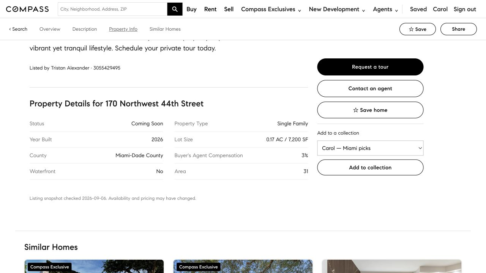
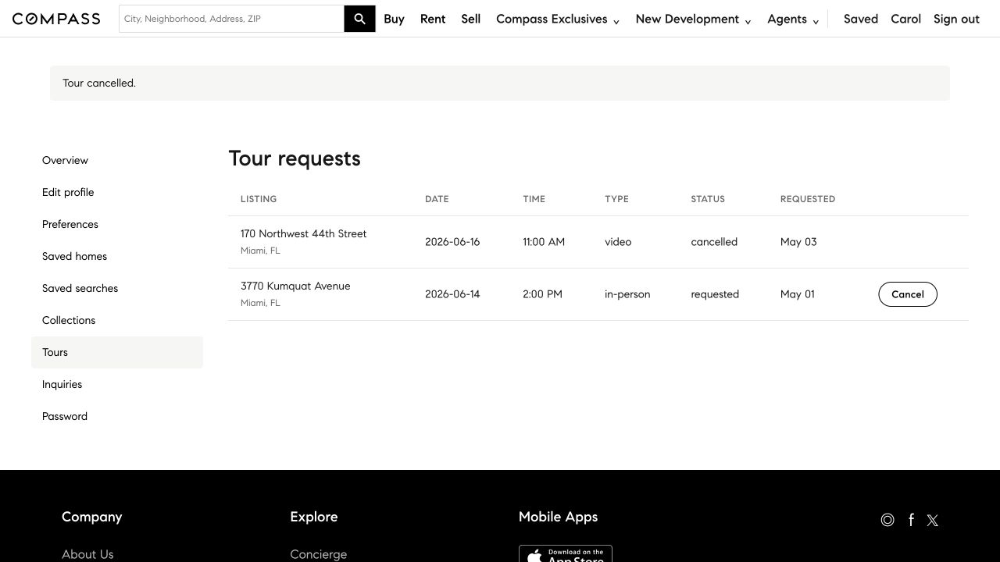
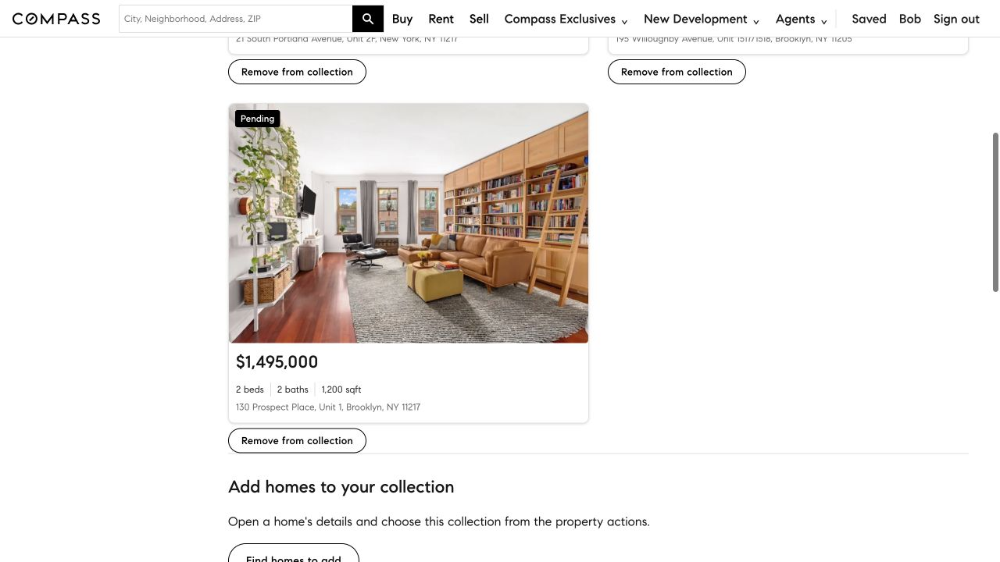
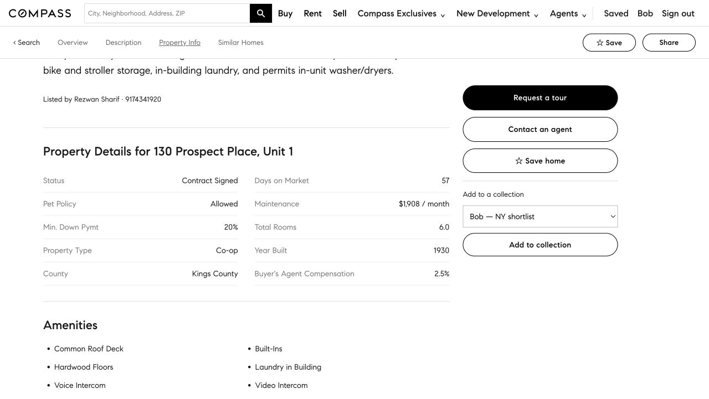
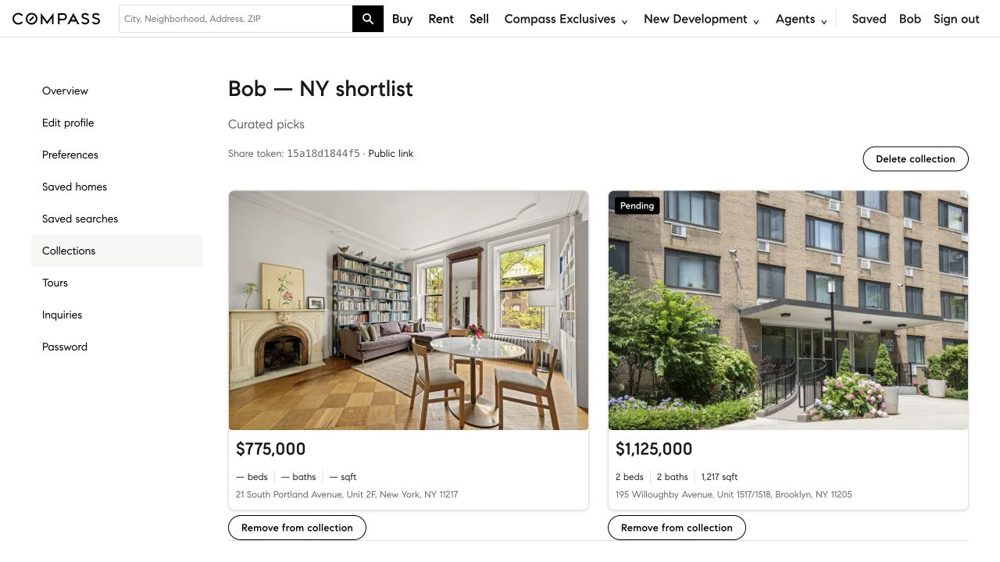
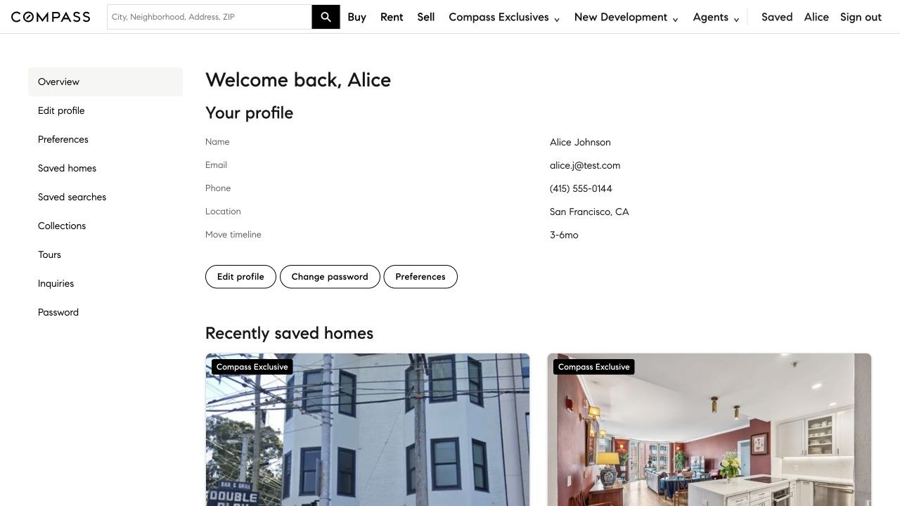
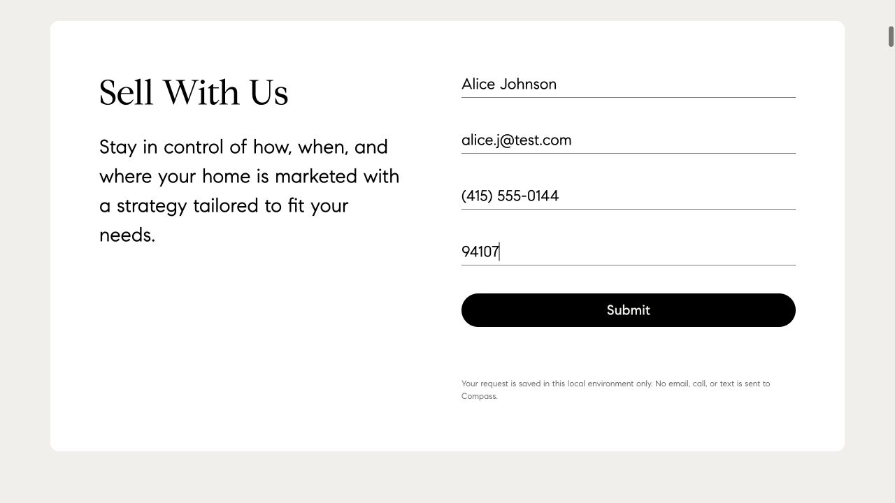
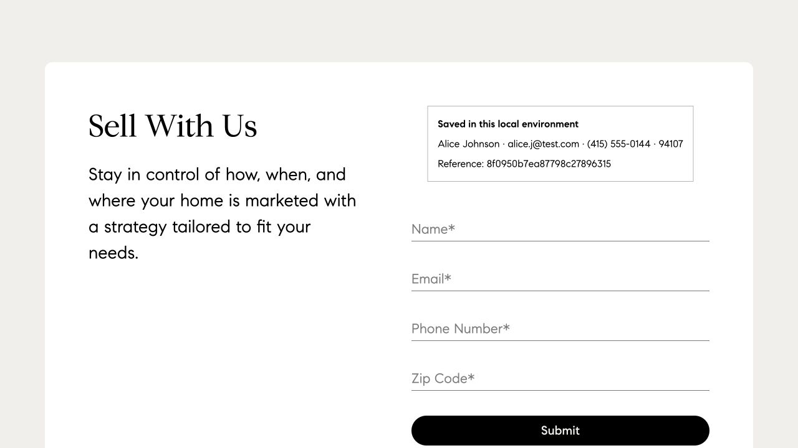

# Compass task expansion

The task set now has **19 task/rubric/verifier contracts**, adding IDs 18–20 while preserving all 16 existing contracts and retired IDs 8/9. This adds three account workflows that the previous set did not cover. Application pages, visual design, source data and HF assets are unchanged.

Task/scorer checkpoint: `4542b35076b07c91ca7b8d96c5d868a185dbf970`. Application: `4574f245573b0fa9c70497661984065b9db819c9`. Assets: `8ade6b3a80d376c801f88e2409b72e8909444927`; Compass archive SHA256 `077cfb2334cb40bf191b2e557c0becd6e28a1901e7ea80183216c1e9db1544aa`. See [machine-readable checks and capture hashes](task-expansion-validation.json).

## Task and verifier audit

| Task | Selection and outcome | Quality and invariant checks | Actual run |
|---|---|---|---|
|18|Compare Carol's two non-cancelled tours by scheduled date; inspect the selected home's construction year; cancel only that tour and confirm on Tours.|Combines list selection, detail lookup and an existing-record state transition. The selected row retains its ID/other fields; all other tours and tables are unchanged. Address/year/cancellation must be correct. Fixed snapshot dates are explicit.|11 steps /22 screenshots; PASS|
|19|Compare known positive price/area ratios inside Bob's existing three-member shortlist; inspect the selected home's year; remove only that member.|Two members have usable area, while the third is explicitly excluded from comparison and preserved. Collection identity/share token, other members and Saved Homes stay unchanged. Member order/JSON spacing are accepted; wrong selection, duplicate/removal of extra members and other writes fail.|12 steps /24 screenshots; PASS|
|20|Read Alice's name/email/phone on the account overview, submit one local Sell inquiry for the requested ZIP, then report its confirmation reference and contact details.|Cross-page transfer of existing values plus a generated result. Exactly one new seller row; no profile change. Phone formatting/email case equivalents are accepted. Reference binds to this new row. The recorded refresh retained the receipt without adding another row.|13 steps /26 screenshots; PASS|

These are modest multi-step stateful tasks, not a claim of independently measured high difficulty. Property details are matched against the retained September 6 original-source records: [selected tour home](https://www.compass.com/homedetails/170-NW-44th-St-Miami-FL-33127/1DXC7A_pid/), [selected collection member](https://www.compass.com/homedetails/130-Prospect-Pl-Unit-1-Brooklyn-NY-11217/27CHGP_pid/), and [other member with known area](https://www.compass.com/homedetails/195-Willoughby-Ave-Unit-1517-1518-Brooklyn-NY-11205/217F32_pid/). Source URL, retrieval time and HTML hash remain in `source_data.json`. These links identify historical snapshot sources, not a claim of newly fetched current listing availability. Account data, appointments and collections are explicitly synthetic. No real agent is contacted.

## Shared verifier correction

The current eleven-table seed exposed a missed compatibility defect: the old loader required exactly nine tables and would reject the current environment before checking the task. Earlier fixture and frozen-run passes did not test this combination. The loader now supports historical snapshots and the two added tables, including `neighborhood_guides`' `slug` key. **All present tables are checked**, even for old tasks; unknown tables and any before/after table addition or removal fail. Unrelated seller inquiries and guide edits cannot be silently ignored.

The failing schema regressions were reproduced first (6 failing/2 passing), then repaired. **222 tests pass**: 54 app/source tests and 168 verifier tests, including 44 new regressions. New coverage includes no-op, wrong answer, missing local navigation, wrong account, unrelated writes, guide edits, schema removal, wrong cancelled tour/status, incorrect or duplicated collection members, wrong contact/reference and duplicate seller inquiries; accepted alternative representations and navigation are also exercised.

All 16 original frozen native exports regrade PASS with the new scorer. Their 932 original execution files and the 39 prepared task 17 follow-up inputs were rehashed unchanged; the old verdict is unchanged. The refreshed task 17 export also regrades PASS. These are **offline rescores of their recorded versions**, not new executions. A separate compatibility fixture exercises the full grading entry on the current 11-table seed.

## Execution and environment boundary

The three new runs contain **36 real browser steps and 72 before/after screenshots**, complete DOM observations, final answers, and complete before/after databases captured before reset. All use the browser's default 1280×720 viewport and a source-aware guided recorder. Original screenshot bytes are retained; the harness PNG export preserves decoded pixels without resizing. Three resets restored the retained runtime seed byte-for-byte.

Docker could not create a fresh QA container because the shared host reported a read-only filesystem. These runs therefore used the documented native Flask startup with a separate database and port 57021. 454 files matched the prior verified runtime, and all 2909 static files matched the pinned archive. The initial partial local attempt revealed missing gallery assets; those were restored from that exact existing archive and the incomplete attempt was excluded before re-recording. Completed runs had no page/form/media HTTP errors; one automatic favicon request returned 404. The owner's runtime and other cases were not changed. No new Docker run or all-site build is claimed.

## Actual UI evidence

| Task 18 details | Cancelled target and preserved other tour |
|---|---|
|||

| Task 19 price/area | Property year | Remaining members and share link |
|---|---|---|
||||

| Task 20 account contact | Completed local form | Receipt after refresh |
|---|---|---|
||||

These eight images are unmodified browser captures from the recorded runs. They show synthetic test information. The earlier [source/before/after UI comparisons](sell-guides-review.md) retain their scope and versions.

## Reproduce and remaining review

Run `python -m pytest sites/compass/tests sites/compass/verify -q`. Each task retains the common verifier CLI, for example:

```sh
python sites/compass/verify/verify_18.py \
  --run_dir /path/to/Compass--18 \
  --initial_db /path/to/Compass--18/before.db \
  --after_db /path/to/Compass--18/after.db --no_llm
```

For a fresh browser execution, use the task's normal port 40021 after resetting Compass. The optional documented native startup can use an isolated database/port as above. Keep actual version, before/after state and every step's screenshots.

A new four-task blind packet combines the unchanged pending task 17 execution with new tasks 18–20: **273 files /88 screenshots**, manifest SHA256 `02a89fbb0442ca1abd93d9c305e014eeea299d2a5f2475e7a448bb691d8b94f8`. It includes task/rubric, actual observations/screenshots/answers, versions and before/after state, and excludes verifier code/results, hidden-answer catalogs and prior conclusions. **Independent results are pending**. Original 16-task independent PASS does not apply to these new tasks or later UI changes. Public Ready remains the owner's earlier lifecycle decision; maintainers still own final review and merging.
